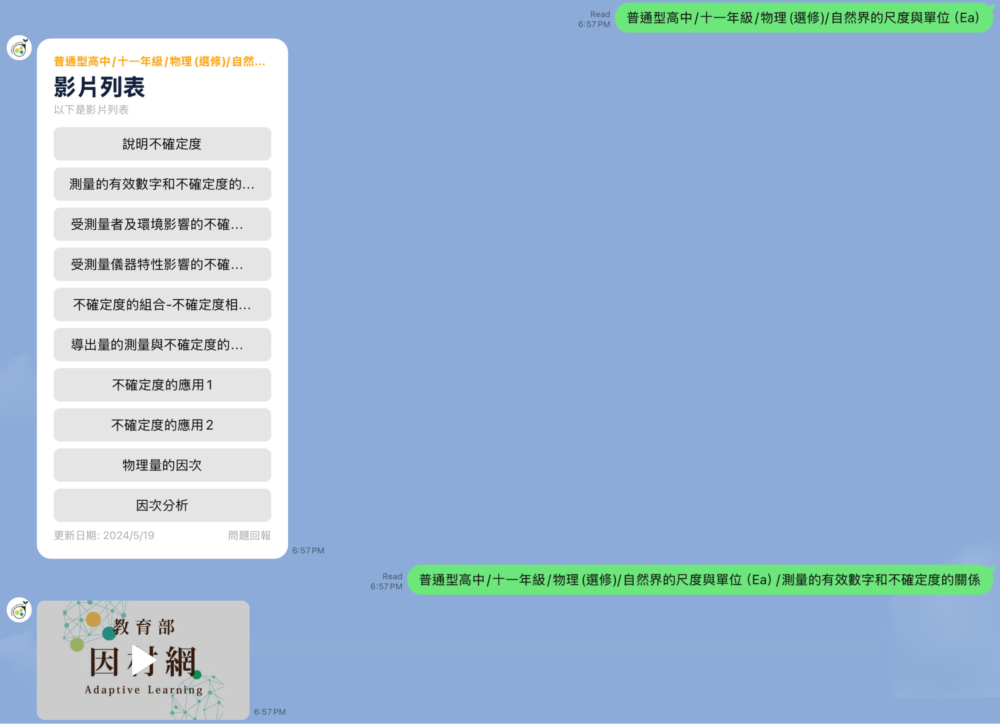

# ADL-Linebot: 教育部因材網影片機器人

> [!NOTE]  
> 此專案目前沒有部署，底下的 Line Bot 帳號並不會進行回覆。若有需求或想測試請自行部署，或到 [Discord](https://dc.elvismao.com) 與我們一起討論！



## [ID: @206usbec](https://lin.ee/LCCKeEI)


因材網的教學影片品質優異，提供了豐富的學習資源。然而，這些影片在使用過程中存在一些技術問題，包括瀏覽器支援度差、UI 不統一、操作複雜、反應速度慢、嚴重跑版、資源耗費大、影片控制限制多、用戶體驗差，以及紀錄和跳轉頁面的錯誤頻繁，更不用提其中的資安問題。

> 參見：[ZeroDay]( https://zeroday.hitcon.org/vulnerability/ZD-2024-00632)


在這種情況下，尤其是在段考前，學生們可能沒有足夠的時間和耐心處理這些問題。為了提供更便捷的學習方式，我開發了這個 Line Bot，讓學生能夠隨時隨地、更輕鬆地免費觀看教學影片。

### 技術實現

這個 Line Bot 使用 Node.js 作為後端語言，並通過爬蟲技術從因材網獲取影片列表，將其保存為 JSON 格式。用戶可以通過 Line Bot 查詢影片列表，並直接在 Line 平台上觀看影片。這樣可以避免因材網上的諸多問題，提供更流暢的學習體驗。

#### 主要技術架構

1. **Node.js**: 作為後端開發語言，負責處理爬蟲、數據存儲和 API 請求。
3. **Line Messaging API**: 負責與用戶的交互，實現消息接收和回應。

#### 爬蟲技術

爬蟲部分的實現通過 axios 及cheerio 進行，自動化瀏覽器操作來獲取因材網上的影片數據，依次抓取科目、課程、課次和影片信息，並將其轉換為 JSON 格式保存。

#### Line Bot 部分

Line Bot 的實現主要包括以下步驟：

1. **創建 Line Messaging API**: 在 Line Developer Console 中創建一個新的 Message API 並獲取 Channel Access Token 和 Channel Secret。
2. **配置環境變量**: 在項目目錄中創建 `.env` 文件，填入相應的配置。

```bash
COOKIE=
CHANNEL_SECRET=
ACCESS_TOKEN＝
```

請先登入英才網帳號並開啟開發者工具。點選隨機功能攔截其中的封包複製整串 cookie 貼上即可。

3. **消息處理邏輯**: 使用 Node.js 和 Line Messaging API，實現消息的接收和回應。

### 部署

在開始部署之前，請確保您的環境已經安裝了 Node.js。然後，按照以下步驟進行操作：

1. 安裝依賴包：

```bash
pnpm i
```

2. 可選：執行爬蟲腳本，依次執行 `subject.js`, `course.js`, `lesson.js`, `video.js` 來獲取完整的影片數據。

3. 在 Line Developer Console 創建一個新的 Message API，將其 Channel Access Token 和 Channel Secret 填入 `.env` 文件中。

4. 啟動服務：

```bash
pnpm start
```

這樣，您的 Line Bot 就可以運行了，用戶可以通過掃描 QR Code 或添加 [ID: @206usbec](https://lin.ee/LCCKeEI) 來使用這個機器人，獲取他們需要的教學影片。

## 備註

此 Line Bot 並非因材網官方製作，而是由個人開發者毛哥EM創建，作為一個開源項目以 Apache License 2.0 發布，僅供學習和研究使用。

### 爬蟲

依序執行 `subject.js`, `course.js`, `lesson.js`, `video.js`。

### Line Bot

在 Line Developer Console 創建一個 Message API，並將其 Channel Access Token 和 Channel Secret 填入 `.env` 文件中。

```bash
CHANNEL_SECRET=
ACCESS_TOKEN＝
```

## 備註

此 Line Bot 並非因材網官方製作，僅為毛哥EM個人作品。此開源專案以 Apache License 2.0 釋出，使用因才網官方 API，僅供學習和研究使用。
