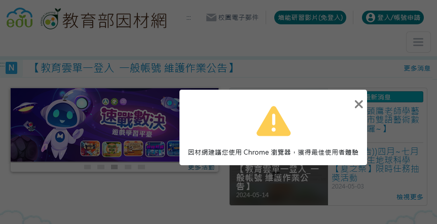

# adl-linebot 教育部因材網影片機器人

## [ID: @206usbec](https://lin.ee/LCCKeEI)


因材網的教學影片品質優異，除了瀏覽器支援度極差、 UI 不統一、操作複雜、反應速度慢、嚴重跑版、資源耗費龐大、影片控制限制多、UX 極差、紀錄常常錯誤、跳轉頁面常常錯誤以外沒有甚麼太大的問題。



段考前實在沒有時間跟它玩線上解謎，因此我製作此 Line Bot，提供一個更便捷的方式讓學生能夠隨時隨地更輕鬆的免費觀看教學影片。

### 技術實現

此 Line Bot 將使用 Node.js 作為後端語言，透過爬蟲技術從因材網獲取影片列表，並將其保存為 JSON 格式。用戶可以通過 Line Bot 查詢影片列表，並直接在Line平台上觀看影片。

期待這些改進能夠為教師和學生提供更好的學研經驗，並進一步推廣適性教學的實踐。

## 部屬

首先請你確保已經安裝了 Node.js 環境，然後執行以下命令安裝相關依賴：

```bash
npm install
```

### 爬蟲

依序執行 `subject.js`, `course.js`, `lesson.js`, `video.js`。

### Line Bot

在 Line Developer Console 創建一個 Message API，並將其 Channel Access Token 和 Channel Secret 填入 `.env` 文件中。

```bash
COOKIE=YOUR_COOKIE
CHANNEL_SECRET=YOUR_CHANNEL_SECRET
```

## 備註

此 Line Bot 並非因材網官方製作，僅為毛哥EM個人作品。此開源專案以 Apache License 2.0 釋出，使用因才網官方 API，僅供學習和研究使用。
